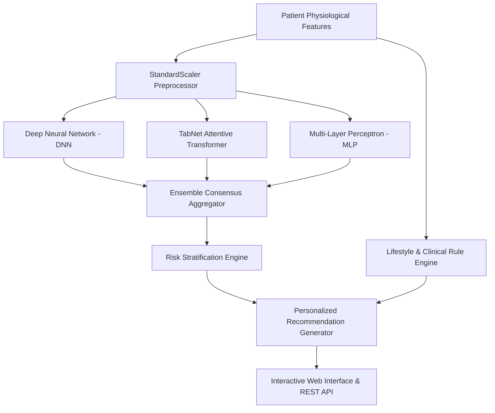
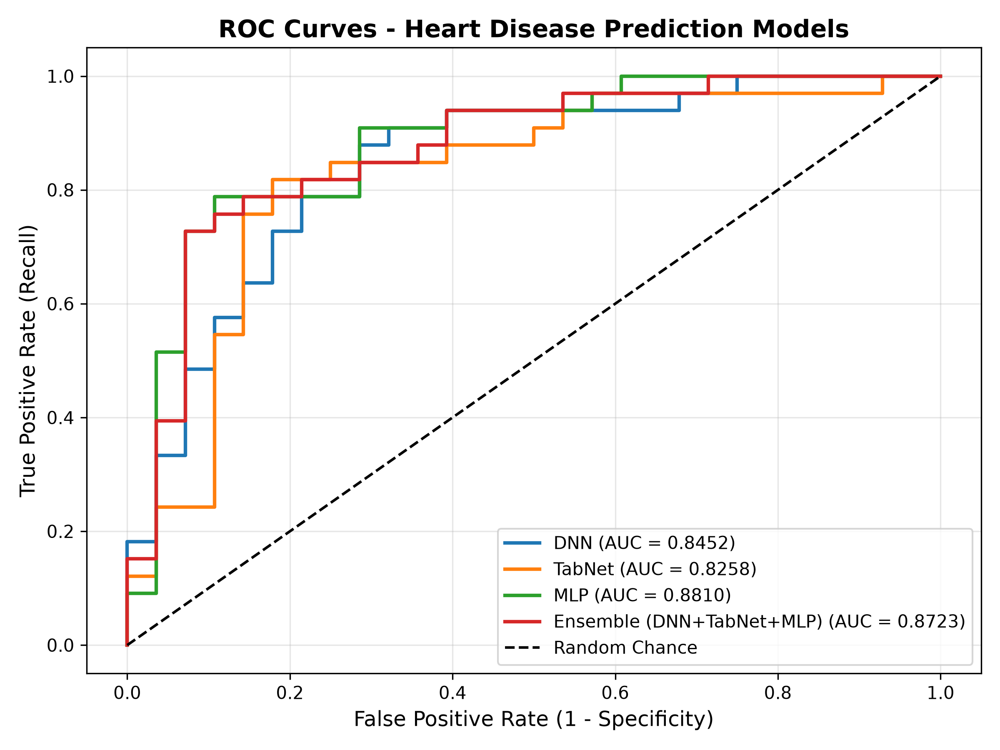
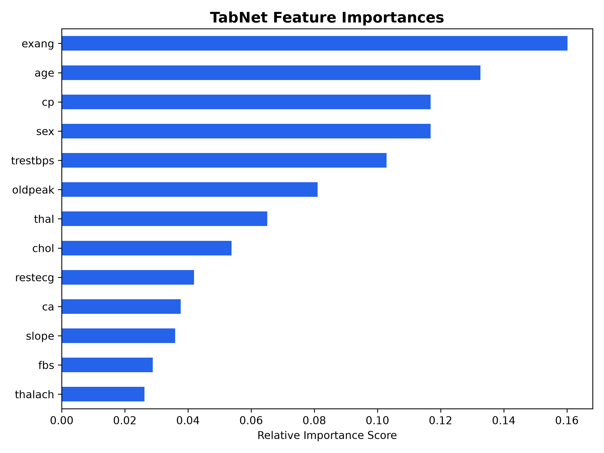
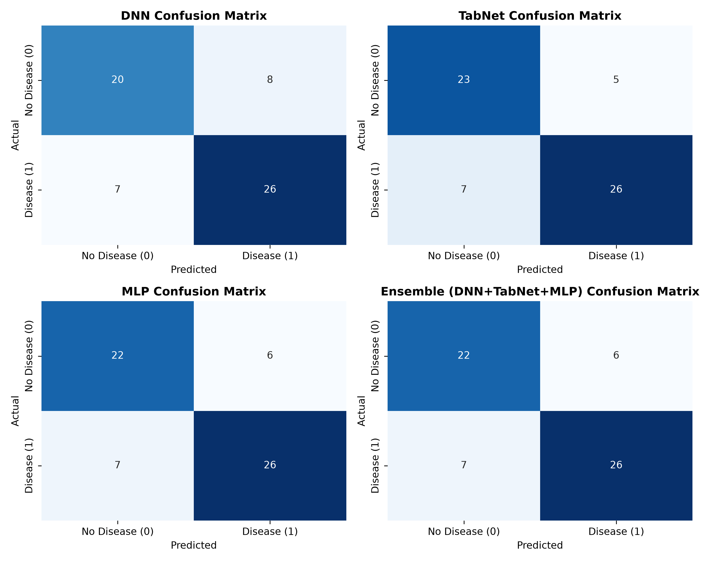
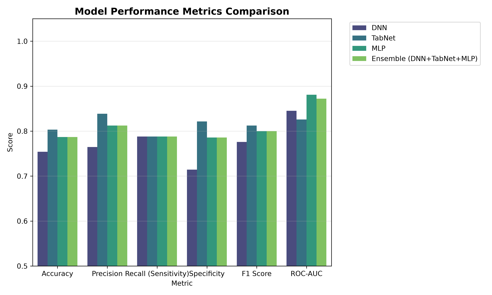

# 🫀 CardioPulse AI
> **Deep Learning & Attentive Transformer Ensemble for Heart Disease Risk Prediction and Evidence-Based Lifestyle Recommendations**

[](https://www.python.org/)
[](https://pytorch.org/)
[](https://flask.palletsprojects.com/)
[](https://scikit-learn.org/)
[](LICENSE)

---

## 📌 Executive Summary

**CardioPulse AI** is an end-to-end clinical decision-support intelligence platform that combines **Deep Neural Networks (DNN)**, **TabNet Attentive Transformers**, and **Multi-Layer Perceptrons (MLP)** into a robust ensemble framework for predicting Cardiovascular Disease (CVD) risk. 

Beyond risk estimation, CardioPulse AI integrates a clinical rule engine that parses physiological parameters—such as resting blood pressure (`trestbps`), serum cholesterol (`chol`), fasting blood sugar (`fbs`), exercise-induced angina (`exang`), and ST segment depression (`oldpeak`)—to synthesize **personalized, actionable clinical and lifestyle recommendations** (dietary adjustments, sodium restrictions, exercise safety protocols, and diagnostic follow-ups).

---

## ✨ Key Features

- **🧠 Multi-Architecture Neural Ensemble**:
  - **Deep Neural Network (DNN)** with Batch Normalization, LeakyReLU, and Dropout.
  - **TabNet Transformer** utilizing attentive masking for feature selection and interpretability on tabular health data.
  - **Multi-Layer Perceptron (MLP)** for non-linear feature interaction mapping.
  - **Consensus Ensemble Integrator** for weighted probability fusion.
- **🩸 Comprehensive Clinical Recommendation Engine**:
  - **Risk Stratification**: Categorizes patients into *Low*, *Moderate*, *High*, and *Very High Risk* tiers with corresponding clinical urgency.
  - **Targeted Guidelines**: Generates tailored interventions for Blood Pressure (DASH diet, sodium limits), Cholesterol (fiber, sterols, statin consultation), Glycemic Control, and Safe Exercise Limits.
- **📊 Automatic Evaluation & Visualization Pipeline**:
  - Automatically exports high-resolution ROC Curves, Confusion Matrices, Model Performance Bar Charts, and TabNet Feature Importance plots.
- **🌐 Interactive Web Dashboard & API**:
  - Modern glassmorphism UI built with Flask, CSS3 custom variables, and FontAwesome icons.
  - RESTful API endpoints (`/api/predict`, `/api/metrics`) supporting real-time JSON input and predictions.
  - Lightweight built-in fallback HTTP server (`server.py`) requiring zero external dependencies beyond standard Python libraries.

---

## 🏗 System Architecture



---

## 📊 Model Performance Comparison

Evaluated on test set data using 5-fold split validation strategy:

| Model | Accuracy | Precision | Recall (Sensitivity) | Specificity | F1-Score | ROC-AUC |
| :--- | :---: | :---: | :---: | :---: | :---: | :---: |
| **TabNet Transformer** | **80.33%** | **83.87%** | 78.79% | **82.14%** | **0.8125** | 0.8258 |
| **Multi-Layer Perceptron (MLP)** | 78.69% | 81.25% | 78.79% | 78.57% | 0.8000 | **0.8810** |
| **Ensemble (Consensus)** | 78.69% | 81.25% | 78.79% | 78.57% | 0.8000 | 0.8723 |
| **Deep Neural Network (DNN)** | 75.41% | 76.47% | 78.79% | 71.43% | 0.7761 | 0.8452 |

---

## 📈 Visual Performance Artifacts

### 1. ROC Curves Evaluation
ROC curves comparing True Positive Rate (Recall) vs False Positive Rate (1 - Specificity) across all models:


### 2. TabNet Feature Importance
Feature importance spectrum derived from TabNet's sparsemax attention mechanism:


### 3. Confusion Matrices
Detailed True Positive, False Positive, True Negative, and False Negative classifications:


### 4. Metrics Benchmark Overview
Side-by-side comparison across Accuracy, Precision, Recall, Specificity, F1-Score, and ROC-AUC:


---

## 📂 Repository Structure

```
CardioPulse-AI/
│
├── dataset/
│   ├── heart.csv               # Raw Heart Disease Dataset
│   └── heart_clean.csv         # Preprocessed Clinical Dataset
│
├── models/
│   ├── dnn_model.pth           # Saved PyTorch DNN Model weights
│   ├── mlp_model.pth           # Saved PyTorch MLP Model weights
│   ├── tabnet_model.zip        # Saved PyTorch-TabNet Model weights
│   ├── scaler.joblib           # Fitted StandardScaler artifact
│   └── feature_names.json      # Ordinal feature registry
│
├── output/
│   ├── confusion_matrices.png  # Classification matrix plot
│   ├── model_comparison.json   # Benchmark JSON output
│   ├── model_comparison.png    # Metrics comparison bar chart
│   ├── roc_curves.png          # Model ROC curves
│   └── tabnet_feature_importance.png # TabNet feature attention plot
│
├── src/
│   ├── agent.py                # CardioPulse Agent API & Orchestration
│   ├── dnn.py                  # PyTorch Deep Neural Network Architecture
│   ├── mlp.py                  # PyTorch Multi-Layer Perceptron Architecture
│   ├── tabnet.py               # TabNet Attentive Transformer Wrapper
│   ├── preprocessing.py        # Data loading, train/val/test splitting, scaling
│   ├── recommendation.py       # Clinical rule & lifestyle advice generator
│   └── train_eval.py           # Training, evaluation & visualization script
│
├── static/
│   ├── script.js               # Dashboard AJAX & Dynamic Rendering logic
│   └── style.css               # Modern UI stylesheet with Glassmorphism
│
├── templates/
│   └── index.html              # Main Clinical Web Interface
│
├── app.py                      # Flask Application Entry Point
├── server.py                   # Lightweight Python HTTP Server Entry Point
├── requirements.txt            # Dependency specification file
└── README.md                   # System Documentation
```

---

## 📋 Clinical Features Schema

The predictive pipeline accepts 13 standardized clinical features:

| Feature | Description | Value Range / Units |
| :--- | :--- | :--- |
| `age` | Patient Age | Years (18 - 100) |
| `sex` | Biological Sex | 0 = Female, 1 = Male |
| `cp` | Chest Pain Type | 0: Typical Angina, 1: Atypical Angina, 2: Non-anginal, 3: Asymptomatic |
| `trestbps` | Resting Blood Pressure | mmHg on admission (80 - 220) |
| `chol` | Serum Cholesterol | mg/dL (100 - 600) |
| `fbs` | Fasting Blood Sugar | > 120 mg/dL (0 = False, 1 = True) |
| `restecg` | Resting ECG Results | 0: Normal, 1: ST-T wave abnormality, 2: Left ventricular hypertrophy |
| `thalach` | Maximum Heart Rate Achieved | bpm (60 - 220) |
| `exang` | Exercise Induced Angina | 0 = No, 1 = Yes |
| `oldpeak` | ST Depression | Depression induced by exercise relative to rest (0.0 - 7.0) |
| `slope` | Slope of Peak Exercise ST | 0: Upsloping, 1: Flat, 2: Downsloping |
| `ca` | Major Vessels Colored by Fluoroscopy | 0 - 4 vessels |
| `thal` | Thalassemia | 0: Normal/Null, 1: Fixed Defect, 2: Normal, 3: Reversible Defect |

---

## 🚀 Quick Start Guide

### 1. Environment Setup

Clone the repository and create a Python virtual environment:

```bash
# Clone Repository
git clone https://github.com/PA1-TECH/CardioPulse-AI.git
cd CardioPulse-AI

# Create and Activate Virtual Environment
python -m venv venv
# On Windows:
venv\Scripts\activate
# On macOS/Linux:
source venv/bin/activate
```

### 2. Install Dependencies

```bash
pip install -r requirements.txt
```

### 3. Model Training & Evaluation

To train all models (DNN, TabNet, MLP) from scratch and regenerate all plots:

```bash
python src/train_eval.py
```

### 4. Run Web Application

#### Option A: Flask Server (Recommended)
```bash
python app.py
```
Open browser at: **`http://localhost:5000`**

#### Option B: Standalone HTTP Server
```bash
python server.py
```
Open browser at: **`http://localhost:5000`**

---

## 📡 REST API Documentation

### `POST /api/predict`
Calculates heart disease risk probability using specified model and generates clinical advice.

#### Request Payload
```json
{
  "model_choice": "ensemble",
  "patient": {
    "age": 58,
    "sex": 1,
    "cp": 2,
    "trestbps": 140,
    "chol": 260,
    "fbs": 1,
    "restecg": 1,
    "thalach": 135,
    "exang": 1,
    "oldpeak": 2.2,
    "slope": 1,
    "ca": 2,
    "thal": 3
  }
}
```

#### Response Payload
```json
{
  "status": "success",
  "data": {
    "selected_model": "Ensemble",
    "selected_prediction": {
      "probability": 0.8425,
      "risk_percentage": 84.25,
      "class": 1
    },
    "model_predictions": {
      "DNN": { "probability": 0.8258, "risk_percentage": 82.58, "class": 1 },
      "TabNet": { "probability": 0.8123, "risk_percentage": 81.23, "class": 1 },
      "MLP": { "probability": 0.8894, "risk_percentage": 88.94, "class": 1 },
      "Ensemble": { "probability": 0.8425, "risk_percentage": 84.25, "class": 1 }
    },
    "recommendations": {
      "risk_category": "Very High Risk",
      "risk_color": "#DC2626",
      "urgency": "Immediate Medical Consultation Required",
      "dietary_advice": [ ... ],
      "bp_advice": [ ... ],
      "exercise_advice": [ ... ],
      "medical_advice": [ ... ],
      "monitoring_advice": [ ... ]
    }
  }
}
```

---

## ⚕️ Disclaimer

> [!IMPORTANT]
> **CardioPulse AI** is intended for educational, research, and clinical decision-support demonstration purposes only. It does not replace professional medical advice, diagnosis, or treatment. Healthcare providers and patients should always consult a licensed cardiologist or medical professional before making clinical decisions.

---

## 📜 License

This project is licensed under the [MIT License](LICENSE).
